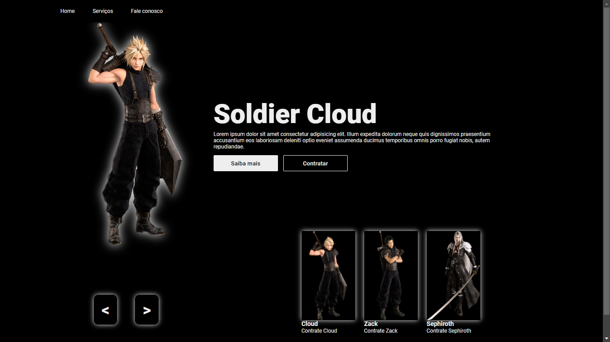
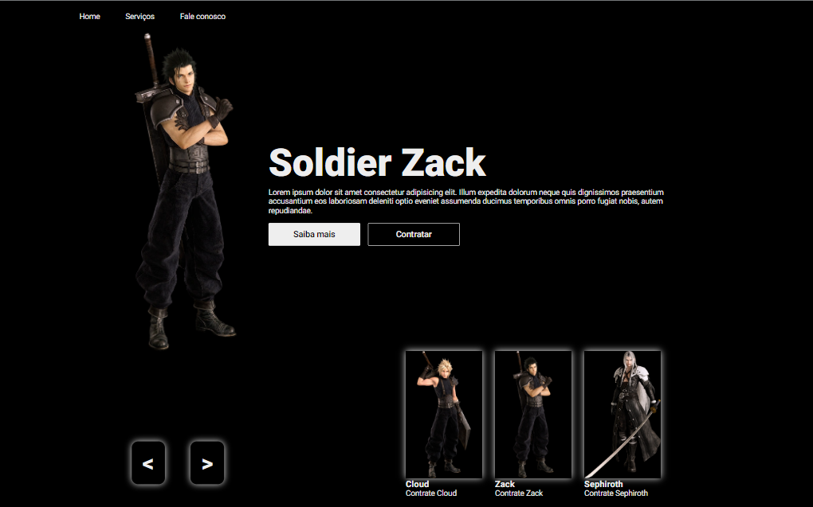
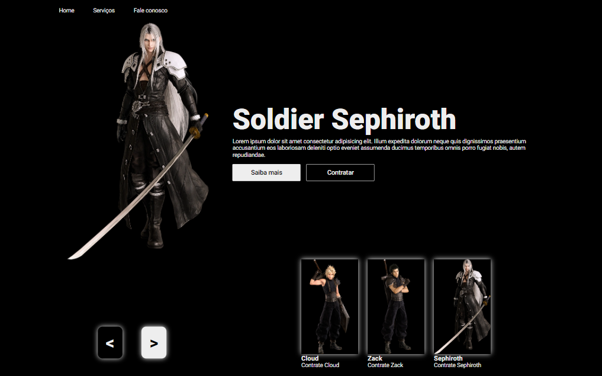

<h1 align="center">Front-End CodeBurguer</h1>

<h2>Olá sejam bem-vindo</h2>

⚔️ Final Fantasy VII: Trazendo Midgar para a Web

Apaixonado por Final Fantasy VII da Sony?  Então você precisa ver meu novo projeto web

Criei uma página minimalista inspirada no icônico RPG, utilizando HTML, CSS e JavaScript. O destaque fica por conta do carrossel dinâmico com imagens memoráveis de Cloud, Zack e Sephiroth.

<h4>O que você pode encontrar:</h4>
<ul>
<li>Imagens de alta qualidade dos personagens mais amados de FFVII.</li>
<li>Código leve e otimizado para velocidade de carregamento.</li>
<li>Carrossel suave com transições elegantes.</li>
</ul>

<h4>Este projeto foi um desafio gratificante e me permitiu explorar:</h4>
<ul>
<li>Habilidades de desenvolvimento front-end.</li>
<li>Criação de interfaces intuitivas e visualmente atraentes..</li>
<li>Paixão por um dos meus jogos favoritos.</li>
<li>Veja o resultado final e compartilhe seus comentários!</li>
</ul>

<h4>Link:</h4>

> Portfólio: https://daliosy.github.io/PORTFOLIO

> Repoditório: https://github.com/DalioSY/codeffvii

> Linkedin: https://www.linkedin.com/in/dalio-s-yamada/

#finalfantasy #ffvii #webdesign #minimalism #html #css #javascript #development #passionproject

 

  <ul align="center">
    <h2 style="display: inline-block">Imagens:</h2>
  </ul>

 
  
  
  
 

